# **_The Digital Pub Quiz - Portfolio Project 2_**

This document contains all the issues necessary to create and develop a website in HTML5 , CSS3 and JavaScript for the website: <a href="https://css-angie.github.io/pub-quiz-challenge/" rel="noopener" target="_blank">The Pub Quiz Challenge</a>. The website is a part of the course “Full Stack Software Development” at Code Institute and showcases the knowledge I have gained so far.

# Table of content

- [The objective of the website](#the-objective-of-the-website)
- [The UX part of creation](#the-ux-part-of-creation)
  - [Creating user stories](#creating-user-stories) 
  - [Designing the layout and structure](#designing-the-layout-and-structure)
  - [Colour Palette](#colour-palette)
  - [Typography](#typography)
  - [Images](#images)
- [Basic Setup](#basic-setup)
  - [Setup of the repository](#setup-of-the-repository)
  - [External sources](#external-sources)
- [Features](#features)
  - [Generic features](#generic-features)
    - [Responsive design](#responsive-design)
    - [Favicon](#favicon)
    - [Navigation](#navigation)
    - [Hero section](#hero-section)
    - [Footer](#footer)
  - [Homepage](#homepage)
    - [Main section](#main-section)
  - [Quiz page](#quiz-page)
  - [Result page](#result-page)
  - [404 page](#404-page)
  - [Sitemap XML page](#sitemap-xml-page)
  - [Privacy Policy](#privacy-policy)
- [Technology used](#technology-used)
  - [Languages](#languages)
  - [Other libraries and programs](#other-libraries-and-programs) 
- [Deployment](#deployment)
- [Testing](#testing)
  - [Main page](#homepage-1)
    - [HTML](#html)
    - [Performance](#performance)
    - [Accessibility](#accessibility)
  - [Quiz page](#plants-page)
    - [HTML](#html-1)
    - [Performance](#performance-1)
    - [Accessibility](#accessibility-1)
  - [Result page](#contact-page-1)
    - [HTML](#html-2)
    - [Performance](#performance-2)
    - [Accessibility](#accessibilit-2y)
  - [404 page](#404-page-1)
    - [HTML](#html-3)
    - [Performance](#performance-3)
    - [Accessibility](#accessibility-3)
  - [Responsiveness of different devices](#responsiveness-of-different-devices)
  - [Manual testing](#manual-testing-of-features)
- [Future features](#future-features)
  - [Timer](#timer)
  - [More questions for several levels](#more-questions-for-several-levels)
  - [Scoreboard](#scoreboard)
  - [Progress bar](#progress-bar)
- [Credits](#credits)
  - [Sources used to write the website](#sources-used-to-write-the-website)
  - [Images](#images-1)
  - [Texts](#texts)
  - [Fonts](#fonts)
  - [Favicon](#favicon-1)
  - [Colours](#colours)
  - [Privacy policy sample text](#privacy-policy-sample-text)
  - [XML-Sitemap](#xml-sitemap)
  - [README](#readme)
- [Acknowledgements](#acknowledgements)

# The objective of the game

Games are played everywhere and a pleasant break in a conversation. But you won’t take a card deck or your newest edition of Trivial Pursuit outdoors. So, if you are enjoying a night in the pub and craving a game, chances are the only option is that slot machine. 
With the “pub quiz machine”  you can take a different turn. Play the game on your own or together and set the best score!

The primary target groups in this case are:
- Pub owners - 	Slot machines gain a certain revenue for the pub owner with every coin spent on the machine. But slot machines come with age restrictions thus need to be watched over and the risk of serious addiction of their visitors causing a loss of revenue, as the gambler won’t buy drinks anymore. 
With the pub quiz machine the revenue of the coin remains, there will be no age restriction and changes of severe addiction are minimal. Which makes it a win-win situation for the pub owner. 
- Owners of places where people enjoy an evening or a (short) stay (hotels, cruise boats, clubs, amusement parlours, restaurants, petrol stations)

Secondary target groups are:
- Pub visitors -	A game is perfect for any social occasion. But with friends discussing the right answer to a question,  taking a small break in conversations, having fun on a night out, a game builds a social cohesion.
- Visitors of the aforementioned places

[Back to top](#table-of-content)

# The UX part of creation

## Creating user stories

As we are not selling the machines at this point but creating the machine itself, we will focus on the secondary group for the design and create user stories linked to the user of the game.
The user story is complemented with acceptance criteria and tasks to be able designing wireframes that contain all features needed.

<b>User Story 1: As a player I want to see directly if I can play a quiz on the site without too much ado</b>

 Acceptance criteria:
- The header is making clear what can be done on the site and more appealing than the simple quiz sites
- No long stories, but a fast way to start the game

Tasks:
- Design a simple starting page that shows a layout with an attractive colour scheme
- Above the fold is all shown that makes it clear you can play a quiz here
- A clear focus point on the page shows how to start the quiz

<b>User-Story 2: As a gamer I want a simple and clean frame so I do not need to figure out how it works.</b>

 Acceptance Criteria:
- The quiz will start as soon as the “Start the challenge!” button is clicked
- A very short explanation how to play the game is displayed above the questions
- Questions and answers are on the same screen displayed (a new page is created for this)
- Mouse shows a pointer to visualise which answer you are about to click

Tasks:

- Create a function that starts the quiz at the first click 
- Create a simple page for the questions
- Create several answer buttons large enough, so there is little chance the wrong answer is clicked
- Display an image related to the question
- Make sure the tip of the mouse displays a hand to click on the wished answer

<b>User Story 3: As a player I want to choose a user name to see my name displayed and my score afterwards.</b>

 Acceptance criteria:
- On the starting page the player can enter his or her name. The name is displayed in the text “Hi ‘Name’!” right above the button with the text: “Start the challenge!”
- After finishing the quiz the final score is displayed in a pop up: the result modal. This modal includes the option to replay

Tasks:
- Create a function that memorizes the name of the player and displays it on the first page of the website
- Create a function to count the score based on the answers
- Create a function to prevent another answer can be selected 
- Show the score at the end of the game in a pop up
- Show a button to restart the quiz

<b>User-story 4: As a gamer I want to know directly after submission if the answer is true or false.</b>

 Acceptance criteria:
- If an answer is clicked the button changes colour to green or red implying the answer to be good or false
- The player must click on the button “Next” to reveal the next question or after a short interval the new question is automatically displayed

Tasks:
- Create a function to read if the answer is correct or not and show the matching colours
- Create a function that randomly searches for another question in the database
- Create a “Next” button to make it possible for the player to continue the play or display the next question automatically

<b>User-Story 5: As a gamer I want to increase the difficulty level after playing the quiz more than once. (Nice to have)</b>

 Acceptance Criteria:
- The quiz contains a number of questions and will display a score after all are answered
- The quiz contains various levels of difficulty: Novice, Experienced, Expert

Tasks:
- The questions are divided over three different levels 
- The option to choose the level of proficiency is displayed on the starting page and at the results page
- The quiz contains a maximum of 10 questions per play

[Back to top](#table-of-content)

## Designing the layout and structure

After creating several user stories, all are used to create a structure that meets all the mentioned requirements i.e. acceptance criteria. Wireframes were made with Balsamic to set the basic guidelines for the process.

 Mockups Homepage 

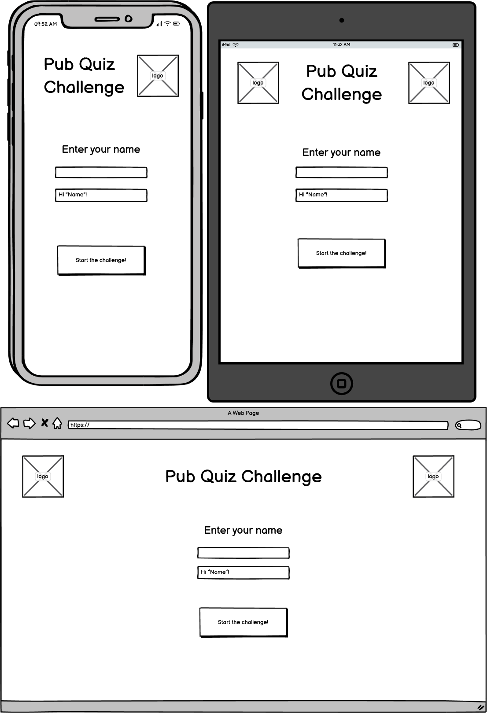

 Mockup Quiz page 

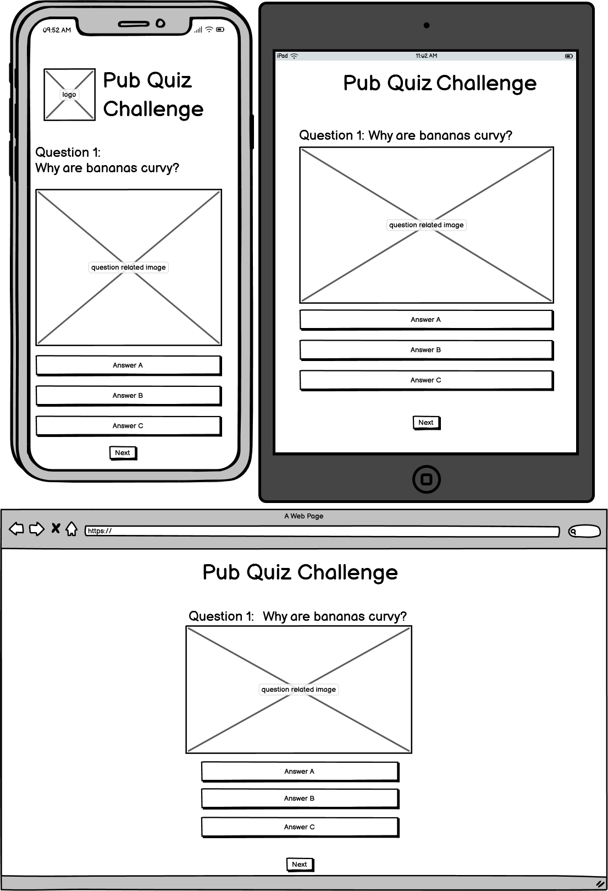 

 Mockups Results page 

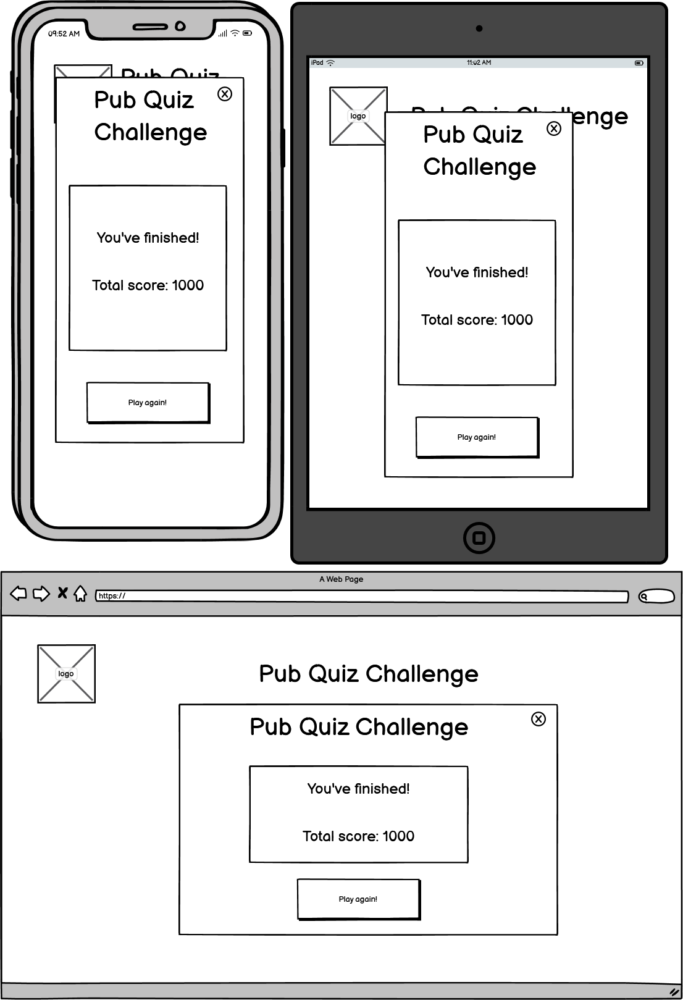

 
## Colour Palette

Being a playful website, the colours can be bolder as usual. 
Based on the psychology of colours the two colours for mind games should be convincing to stay at the site and play the quiz.
Orange is the colour usually boosting the confidence of a player, alongside with bravery and a feeling of success.
Blue is the colour related to trust, loyalty and competence. 
Trust and confidence are both needed for playing any game, so a combination of these two are a great match. Taking the bold variations helps us to avoid any contrast errors when used for the website. The lighter variations are only used for contrast that does not involve any reading.

The colour scheme is a personal combination taking the contrast in consideration and put in [coolors.co](https://coolors.co) to find the names to the HEX-colours.
The colours are: 
#151C4A dark blue - space cadet  
#0069B0 azure blue - azul  
#F88839 bright orange – orange (wheel)  
#E4B681 light orange – selective yellow  
#FFD880 light yellow - jasmine 

## Typography

The criteria for the fonts were:

- Heading should be playful.
- The primary font should be very readable as the quiz exist of textual questions. Very readable means an open font and sans serif.
Looking in the Google Fonts library I found the appealing font Bungee for the header and the open and very readable Open Sans for the body text.
Bungee has a fallback of cursive and Open Sans sans-serif.

## Images

The images should fit the question asked, for example: if the question is about Mickey Mouse, than a picture of Mickey must be displayed. Therefore, every question has a different picture.
The logo represents fun, togetherness and the realm of a pub. 
The favicon is representing the two letters of pub quiz “PQ” as the logo is too complicated to change into a favicon. 
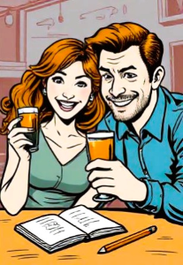

[Back to top](#table-of-content)

# Basic Setup

## Setup of the repository

The basic setup started with setting up the repository for the project in Github. Within it creating a project board and filling the board with the user stories and their requirements with the subsequent tasks, labelling every task in the to-do section with must-have, should-have, and could-have.
Along with it the basics of the website were created with the folder structure:   - index.html with boilerplate and connection to 1. the style.css stylesheet and 2. the script.js javascript;  - assets - css - style.css;  - assets - js – script.js;   - assets - favicon and fill this with the generated favicon;  - assets – images with a logo and within the images folder another folder named quiz-images with the images displayed at the questions.

## External sources
External sources used in this project are:  - Google Fonts. 
These were added at the common places.

The setup was checked and deployed and ready to be filled with all features.

[Back to top](#table-of-content)

# Features

## Generic features

### Responsive design

The most important generic feature of any website is the responsive design to ensure a great user experience on any device. This was achieved by using flex-boxes, and media queries. The common DOM breakpoints were used here. Main issues for a clean responsive design were: hero section on all pages and the input section on the main page. To keep the question buttons within proportion the width has been narrowed at all CSS breakpoints.

### Favicon

The favicon is a beacon in all tabs opened and offers visitors a quick reminder of the site. It is important to have a favicon that represents the website.
By using the letters P Q of Pub Quiz the main contrast colour and making it into a favicon at [favicon](https://favicon.io) the site shows consistency and offers a recognizable favicon. 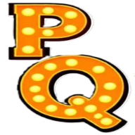

### Navigation

The navigation on this particular website is not exactly a general navigation we can expect on the usual websites. Because we are working with a quiz the navigation should largely be done for the user. 
Navigation this time is a click on buttons in various stages. 
First at the main page we have two buttons: one for displaying the name and a button to start the quiz. This leads to the actual page where the quiz will begin right away. By clicking an answer the automatic navigation will show the next question. At last the quiz will display the results at the third page, on which a button is shown to restart the quiz. 
As users have the expectancy to return to main page, when clicking on the header. This navigation item is incorporated as well as an extra service. As this is of no importance to the function of the website, this function is not highlighted for the visitors. 

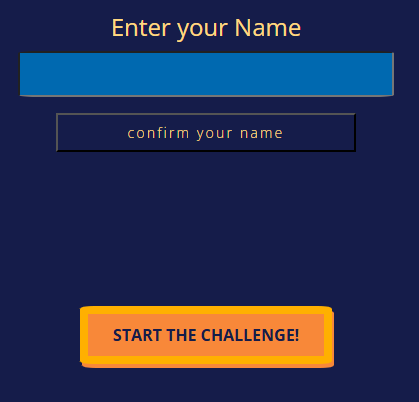 
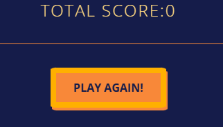

### Hero section

The hero banner is a returning focus point at all pages. 
In this case the logo is shown on al pages, except for the larger devices, where the image is taken out and only text is displayed. As the header will get too high, the header takes up a lot of space at larger devices. Shrinking the image makes it looking cropped and this is quite distracting in a negative way. 

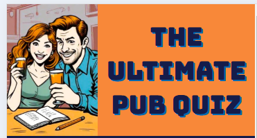

 Hero section large(r) devices 

 

### Footer

The footer only contains a copyright signature and the link to the privacy policy. An XML page could will not offer any benefit and will be left out.

## Homepage

### Main section

The main section comprises two parts.
 First a short introduction tries to persuade the visitor to play a little quiz. The visitor is invited to type and confirm the name by pushing the first button. 
After confirming a small popup-box appears to welcome the visitor, displaying the typed name.
Second, a large button is shown with the text “Start the challenge!”. Combined with the playful colours by now the visitor should be convinced to start the game.
Pushing this button will lead to the page where the actual quiz will be played.
Being able to chose a level (novice, experienced and expert) is a really nice would-have to make the visitors coming back over time. 

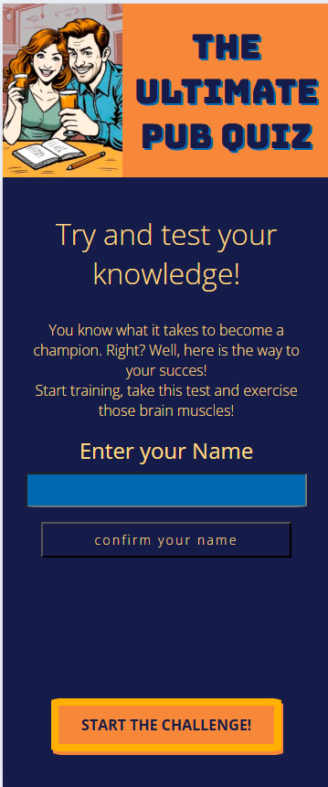 

 Homepage large(r) devices and with name displayed 

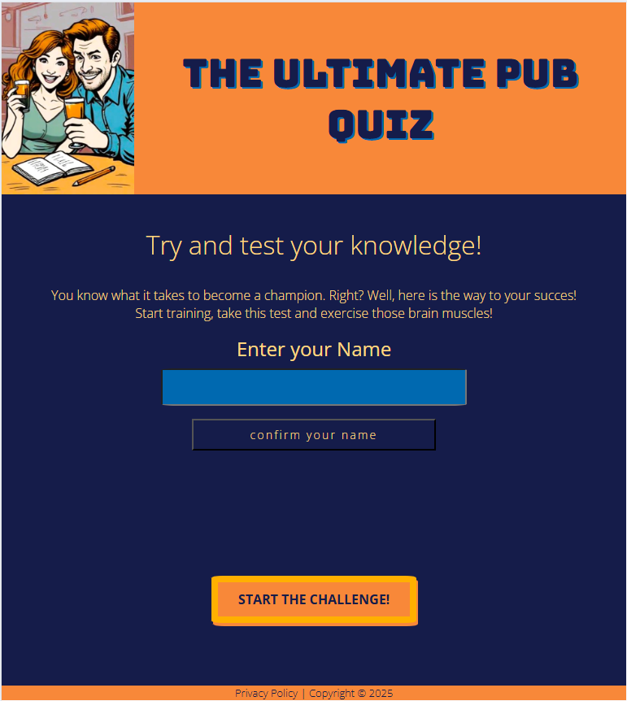
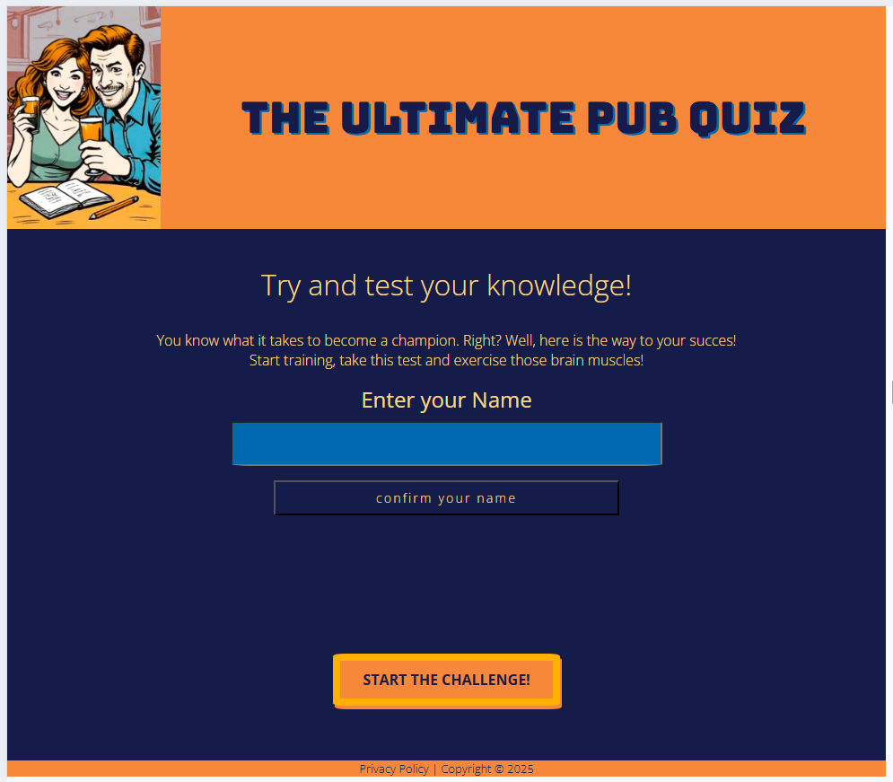 >
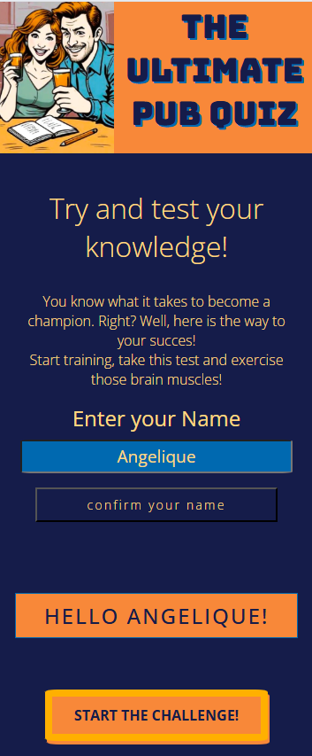
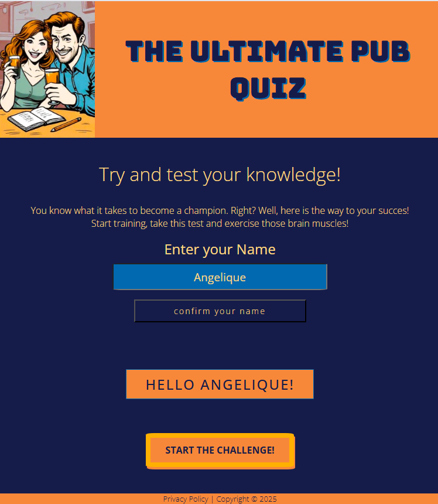

## Quiz page

The actual quiz is displayed on this page. As soon as the button “Start the challenge!” is pushed at the main page, the quiz will display the first question at this page. 
The first thing to be seen is the hero section: the logo with the name of the quiz. Depending on the size of the screen the visitor is using, the logo will disappear (from 768px and up).  
A miniscule explanation is written underneath the hero section, followed by the actual question. To lighten things up and make it more appealing a matching image is shown with a hint before three possible answers are shown. The answers are wrapped within a button which can be clicked. The visitor only has one chance to find the right answer. If the answer is correct or not will be shown right away by changing the colour to respectively green or red.
After a minor delay the next question is shown.  
After 10 questions the quiz is done and the visitor will be informed what the final score is.

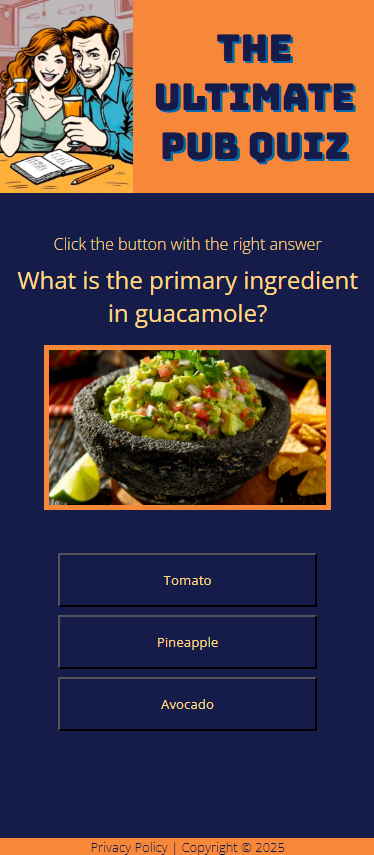 

 Hero section large(r) devices 

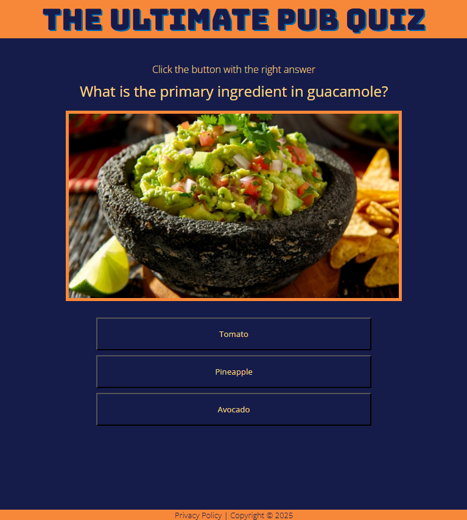 
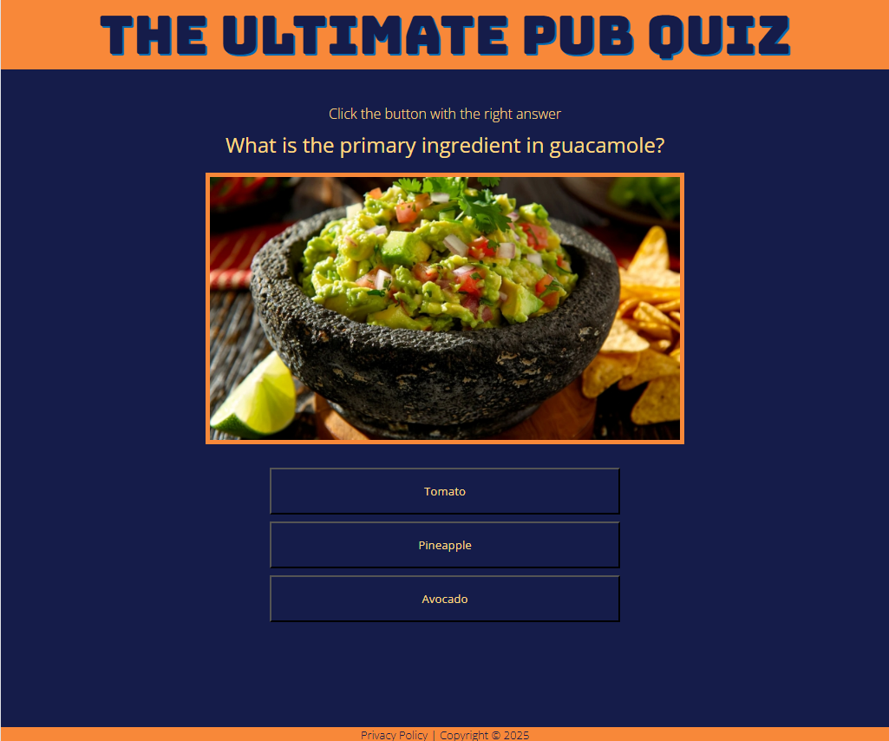

## Result page

-----------------------------------------
## 404 page

Sometimes things go wrong. This is where the 404 page comes in.  
As it must be clear, that something went wrong, the 404 shows a text that the page looking for, does not exist. 
Thee hero section is maintained as of the homepage and large letters OOPS! make it clear this is not a page where anything can be expected. The large button in the same style as used on other locations on the website helps the user to return to the starting point, offering help to (re)start the game.

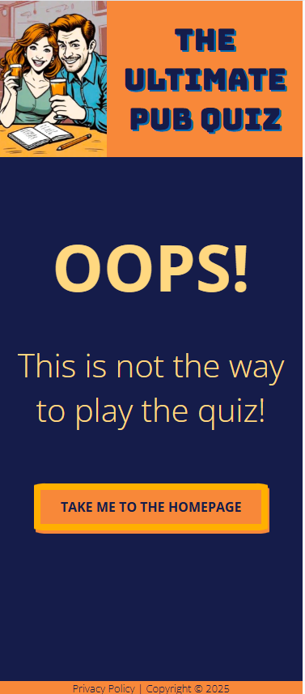

Screenshot Large(r) Device

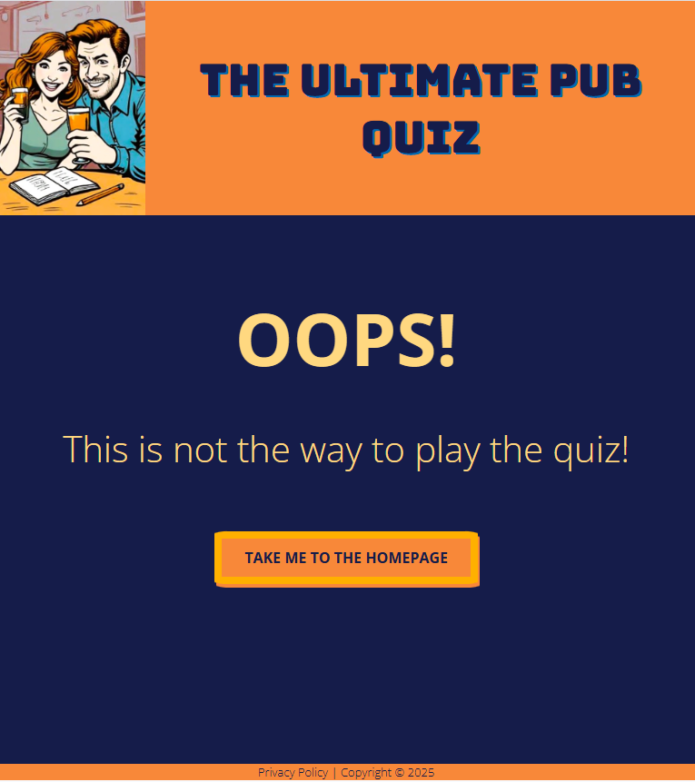 
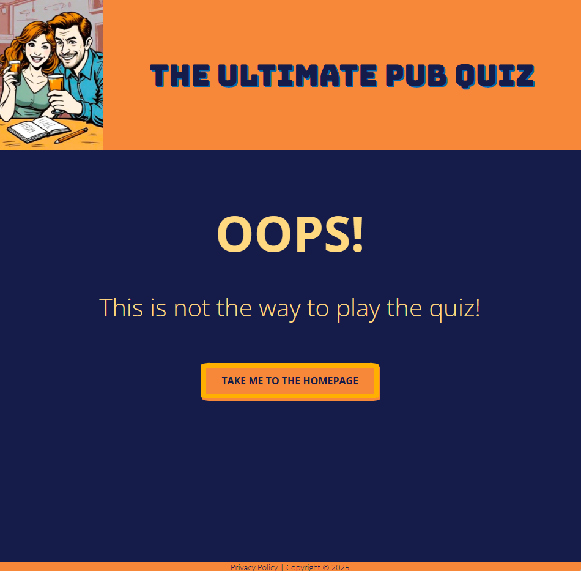 

## Sitemap XML page

Almost every website needs a sitemap. Making it easier for search engines to understand the infrastructure of the website, an XML Sitemap is added. As we are dealing here with only one official page, inserting an sitemap is redundant. This is seen in this XML Sitemap generated at [XML Sitemap Generator](https://www.xml-sitemaps.com)

Screenshot Sitemap

 

## Privacy Policy

At every website a privacy policy page is mandatory. As this project will not be displayed to unknown visitors, a template is used, which was generated at [Moneris](https://developer.moneris.com/More/Compliance/Sample%20Privacy%20Policy)

Screenshot Privacy Policy

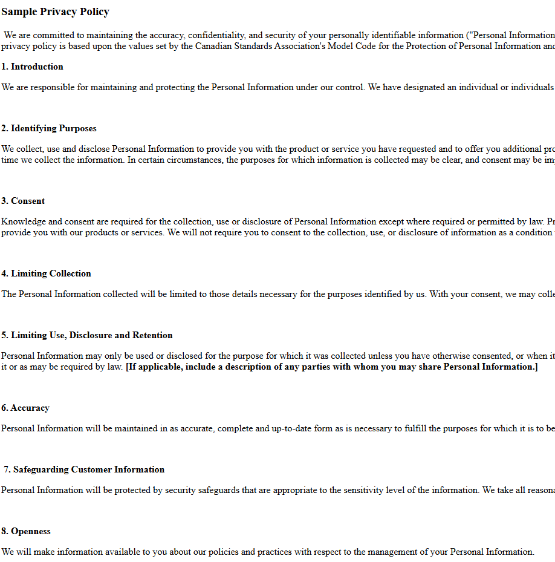

[Back to top](#table-of-content)

# Technology used

## Languages:

- HTML
- CSS
- JavaScript 

## Other libraries and programs:

- Font Library [Google Fonts](https://fonts.google.com)
- Color Library [Coolors](https://coolors.co)
- Balsamic app for creating wireframes
- VS Code for writing code
- Project Overview and deployment [Github](https://github.com/)
- AI Image Generator [Deep AI](https://deepai.org)

[Back to top](#table-of-content)

# Deployment

Deployment was done with Github.

To deploy the website the following steps should be taken:

1. Login to Github
2. Find the repository of the project. In this case: [CSS Angie – Pub Quiz Challenge]( https://github.com/CSS-Angie/pub-quiz-challenge)
3. Go to Pages in the navigation menu left under Settings.
4. Under branch change None to main and keep /root and click save next to these two dropdowns.
5. The site will be deployed after clicking save.
6. Return to the page "<>Code", and on the right side you'll find deployments. Clicking on it will open a new page, where you'll find the link to open the deployed site.

[Back to top](#table-of-content)
# Future features

The website is just a start of a website, that can be expanded excessively. There are several features to build in, that would definitely be an upgrade to the website.

## Timer

A timer which differentiates the score of each question makes the quiz more exciting.

## More questions for several levels

Wanting to entertain the users every time they visit, it is necessary to offer lots of questions to prevent showing the same questions over and over again.

## Scoreboard

If you want to seduce a user coming more often at your site, there is need for a reason. One is of course the great answers, but the main reason could be the eager of a user to be in the first place and stay there as long as possible. Therefore a scoreboard will be a great future feature to have on the website.

## Progress bar

Seeing the progress in the number of questions asked and yet to come is a nice to have feature.
Perhaps it should not be a progress bar, but the number of questions displayed in numbers (for example if you are at question 4 out of 10 questions, 4/10 will be shown). Which variant to choose should be researched.

# Credits

## Sources used to write the website

- Code Institute Course Content was very helpful for creating this website.
- Extensive use of https://www.stackoverflow.com.
- YouTube videos of different channels. Not all of them were very helpful, actually most of them confused me more instead of helping understanding JS, but there is one I would like to mention as a great source of explaining JS for dummies: [Web Dev Simplified]( https://www.youtube.com/@WebDevSimplified).
- The basic code from the modal was taken from [W3 schools](https://www.w3schools.com)

## Images

The logo is AI generated with [DeepAI](https://deepai.org);
The images to the answers are found at the following sites:
- Frozen -[HomewallMurals]( https://www.homewallmurals.co.uk/);
- Mickey and dog - [PeakPx](https://www.peakpx.com/);
- Mickey and friends – [Disney](https://www.disney.com);
- Jungle Book – [Amazon](https://www.amazon.com/);
-Toy Story - [AlphaCoders](https://wall.alphacoders.com/);
-Tower of Pisa – [DW](https://www.dw.com);
-Legally Blonde - [ReelGood](https://blog.reelgood.com/);
- Ratatouille – [Pinterest](https://pinterest.com);
- Aladdin – [DisneyPlus](https://www.disneyplus.com);
- Guacamole – AI generated with [DeepAI](https://deepai.org);
- Blue whale – [Dana Wharf](https://www.danawharf.com);
- Chernobyl – [Destinations Unknown](https://www.destinationsunknown.com);
- Cinderella – [Substack](https://www.substack.com);
- Cacao Beans – [Indiamart](https://www.indiamart.com);
- Charlie Chaplin – [Borsonline](https://www.borsonline.hu);
- Cocaine – [Spring Hill Recovery Center](https://www.springhillrecoverycenter.com);
- Gouda cheese – [Kazecheese Blog](https://www.kazecheese.com);
- Grinch – [Gamebuster](https://www.gamebuster.com);
- Elf - AI generated with [DeepAI](https://deepai.org);
- Question mark – [Unsplash](https://www.unsplash.com);
- Groot – [Goodfon](https://www.goodfon.com);
- Helium sign – [Cleanpng](https://www.cleanpng.com);
- Heinz – [Archbridge Institute](https://www.archbridgeinstitute.com);
- Iceland food – [TourHQ](https://www.tourhq.com);
- Japanese lady – [Mitsubishi](https://www.mitsubishi.com);
- JFK and his wife – [Fine Arts Storehouse](https://www.fineartsstorehouse.com);
- Maple leaf flag – [les tresors derable]( https://lestresorsderable.com);
- Mr Pibb – [Pic Click](https://www.picclickimg.com);
- Nemo – [Charactour](https://www.charactour.com);
- Night Museum – [Medium](https://www.medium.com);
- Joconde – [Nico Franz Art](https://www.nicofranz.art);
- Panda – [DW](https://www.dw.com);
- Plant – [Teenager Today](https://www.teenagertoday.com);
- Pokerface – [Roger](https://www.roger.com);
- Popular drinks – [Calow Drinks](https://www.calow-drinks.com);
- Porsche – [Porsche](https://www.porsche.com);
- PS5 – [Playstation](https://www.playstation.com);
- Thor – [Comicbook Club](https://www.comicbookclublive.com);
- Zoo – [Rehlat](https://www.rehlat.ae);
   
  All images are compressed with [TinyJPG](https://tinypng.com) 
  All images are converted to .webp extension with [Convertio](https://convertio.co)

## Questions

Almost all questions are taken from the website:
- [QuizWitz]( https://www.quizwitz.com/nl/blog/2023/02/03/101-most-popular-questions/)

## Fonts

All fonts at the site were found in the [Google Fonts Library](https://fonts.google.com).

## Favicon

The great favicon was created with [favicon.io](https://www.favicon.io).

## Colours

The names matching the personal choice were found at [Coolors](https://coolors.co)

## Privacy Policy sample text

At [Moneris](https://developer.moneris.com/More/Compliance/Sample%20Privacy%20Policy) a sample of a privacy policy could be copied.

## XML-Sitemap

XML-Sitemap was created with the free [Online Sitemap Generator](https://www.xml-sitemaps.com)

[Back to top](#table-of-content)

# Acknowledgements

Gareth McGirr, my mentor, for all his help and advice throughout the project. 
Kristyna Wach, my tutor, for taking of me and keeping me motivated.

[Back to top](#table-of-content)

